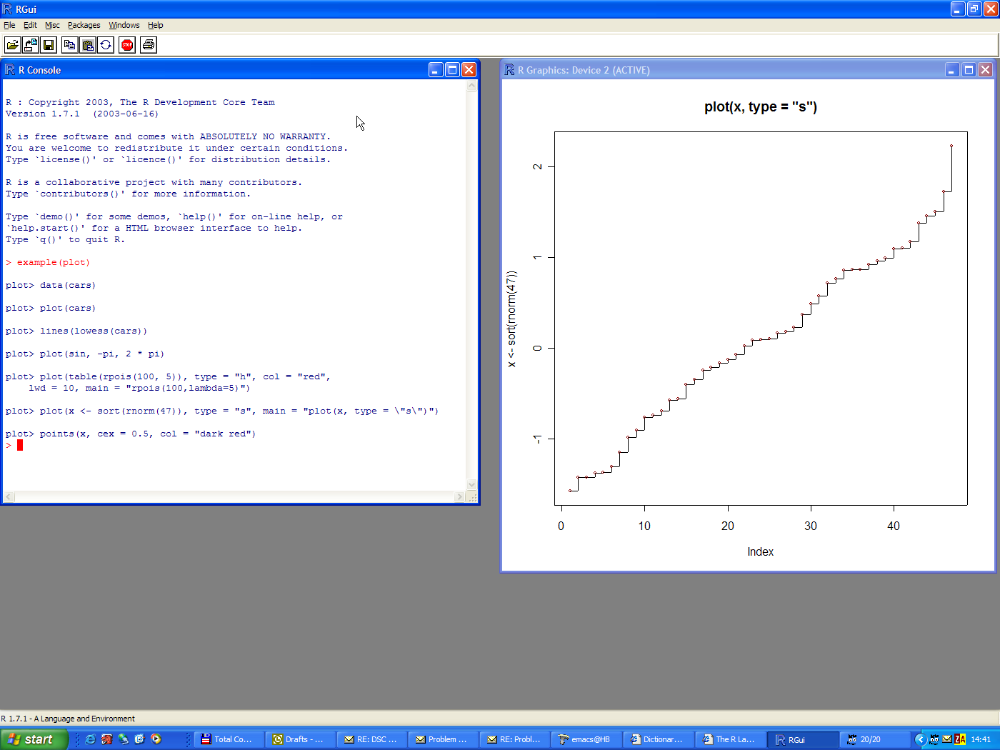

## The Five Things

1. Getting data from a database or website
2. Cleaning data
3. Making charts and graphs
4. Interacting with data
5. Creating presentations and reports

---

## Getting R

R - https://cran.r-project.org/



[Image Source](https://www.google.com/url?sa=i&rct=j&q=&esrc=s&source=images&cd=&cad=rja&uact=8&ved=0CAcQjRxqFQoTCKuC7pugkMcCFYg2PgodIG8AVQ&url=%2Furl%3Fsa%3Di%26rct%3Dj%26q%3D%26esrc%3Ds%26source%3Dimages%26cd%3D%26cad%3Drja%26uact%3D8%26ved%3D0CAcQjRxqFQoTCKuC7pugkMcCFYg2PgodIG8AVQ%26url%3Dhttp%253A%252F%252Fwww1.maths.lth.se%252Fhelp%252FR%252FRgui%252F%26ei%3DfR7BVevPEojt-AGg3oGoBQ%26psig%3DAFQjCNHcXMn3_Guho98-XhweTug0DSOM2Q%26ust%3D1438805945502363&ei=fR7BVevPEojt-AGg3oGoBQ&psig=AFQjCNHcXMn3_Guho98-XhweTug0DSOM2Q&ust=1438805945502363)

---

## Getting R

RStudio - https://www.rstudio.com/products/rstudio/download/


[Image Source](https://www.google.com/url?sa=i&rct=j&q=&esrc=s&source=images&cd=&cad=rja&uact=8&ved=0CAcQjRxqFQoTCNqPto2ikMcCFYZzPgod2gwJxw&url=http%3A%2F%2Fpages.vassar.edu%2Facs%2Fr-for-data-analysis-and-graphics%2F&ei=dyDBVZr4Nobn-QHamaS4DA&psig=AFQjCNF15zfiNo6uv0LN55PdFt_5MLacDA&ust=1438806518209134)

---

## Basics

* Use the `<-` operator to assign
* You don't have to use `;` at the end of lines, unless combining commands
* You don't have to declare a specific type
* Object-oriented people: don't let the `.` trick you

```{r}
x <- 1
x

y <- c(2, "red", 4); print(y)
```

---

## 1. Getting data from a database or website

```{r}
fileUrl <- "http://data.baltimorecity.gov/api/views/dz54-2aru/rows.csv?accessType=DOWNLOAD"
download.file(fileUrl, destfile="./data/cameras.csv")
```

[Source: JHU-DS](https://github.com/rdpeng/courses/tree/master/03_GettingData)

---

## Basics: Data Frames

```{r}
d <- c(1, 2, 3, 4)
e <- c("red", "white", "red", NA)
f <- c(TRUE, TRUE, TRUE, FALSE)
mydata <- data.frame(d, e, f)
names(mydata) <- c("ID", "Color", "Passed") # variable names
print(mydata)
```

Source: http://www.statmethods.net/input/datatypes.html

---

## Basics: Data Frames

```{r}
print(mydata)
mydata[3, 2]
```

---

## 1. Getting data from a database or website

```{r}
cameraData <- read.table("./data/cameras.csv",sep=",",header=TRUE)
head(cameraData)
```

[Source: JHU-DS](https://github.com/rdpeng/courses/tree/master/03_GettingData)

---

## 1. Getting data from a database or website

Database connections  
  
[PostgreSQL - "RPostgreSQL"](https://cran.r-project.org/web/packages/RPostgreSQL/index.html)

[Oracle - "ROracle"](https://cran.r-project.org/web/packages/ROracle/index.html)

[MySQL - "RMySQL"](https://cran.r-project.org/web/packages/RMySQL/index.html)

---

## 1. Getting data from a database or website

PostgreSQL example
  
```{r, eval=FALSE}
drv <- dbDriver("PostgreSQL")                       # Load driver
con <- dbConnect(drv, dbname="tempdb")              # Connect
rs <- dbSendQuery(con, "select * from TableName")   # Run a query
fetch(rs, n=-1)                                     # Return all elements
dbDisconnect(con)                                   # Disconnect
dbUnloadDriver(drv)                                 # Unload driver
```

Source: https://code.google.com/p/rpostgresql/

---

## 2. Cleaning data

```{r, warning=FALSE}
fileUrl <- "http://data.baltimorecity.gov/api/views/k5ry-ef3g/rows.csv?accessType=DOWNLOAD"
download.file(fileUrl, destfile="./data/restaurants.csv")
restData <- read.csv("./data/restaurants.csv")
```

[Source: JHU-DS](https://github.com/rdpeng/courses/blob/master/03_GettingData/03_02_summarizingData/index.Rmd)

---

## 2. Cleaning data

Summarizing data

```{r}
str(restData)
```

[Source: JHU-DS](https://github.com/rdpeng/courses/blob/master/03_GettingData/03_02_summarizingData/index.Rmd)

---

## Basics: Factors

```{r}
# variable gender with 20 "male" entries and 30 "female" entries 
gender <- c(rep("male",20), rep("female", 30)) 
gender <- factor(gender) 
# stores gender as 20 1s and 30 2s and associates
# 1=female, 2=male internally (alphabetically)
summary(gender)
str(gender)
```

Source: http://www.statmethods.net/input/datatypes.html

---

## 2. Cleaning data

Finding missing values with `is.na`

```{r}
sum(is.na(restData$councilDistrict))
all(restData$zipCode > 0)
```

[Source: JHU-DS](https://github.com/rdpeng/courses/blob/master/03_GettingData/03_02_summarizingData/index.Rmd)

---

## 2. Cleaning data

Finding specific values

```{r}
table(restData$zipCode %in% c("21212"))
table(restData$zipCode %in% c("21212","21213"))
```

[Source: JHU-DS](https://github.com/rdpeng/courses/blob/master/03_GettingData/03_02_summarizingData/index.Rmd)

---

## 3. Making charts and graphs

Loading `ggplot2`

```{r, eval=FALSE}
install.packages("ggplot2")
```

```{r, warning=FALSE, error=FALSE, message=FALSE}
library(ggplot2)
```

See also: http://docs.ggplot2.org/current/

---

## 3. Making charts and graphs

Example dataset `mpg`

```{r, warning=FALSE, error=FALSE, message=FALSE}
str(mpg)
```

[Source: JHU-DS](https://github.com/rdpeng/courses/blob/master/04_ExploratoryAnalysis/ggplot2/ggplot2_p1.Rmd)

---

## 3. Making charts and graphs

```{r, warning=FALSE, error=FALSE, message=FALSE, fig.height=5, fig.width=12}
qplot(displ, hwy, data = mpg)
```

[Source: JHU-DS](https://github.com/rdpeng/courses/blob/master/04_ExploratoryAnalysis/ggplot2/ggplot2_p1.Rmd)

---

## 3. Making charts and graphs

```{r, warning=FALSE, error=FALSE, message=FALSE, fig.height=5, fig.width=12}
qplot(displ, hwy, data = mpg, color = drv)
```

[Source: JHU-DS](https://github.com/rdpeng/courses/blob/master/04_ExploratoryAnalysis/ggplot2/ggplot2_p1.Rmd)

---

## 3. Making charts and graphs

```{r, warning=FALSE, error=FALSE, message=FALSE, fig.height=5, fig.width=12}
qplot(displ, hwy, data = mpg, geom = c("point", "smooth"))
```

[Source: JHU-DS](https://github.com/rdpeng/courses/blob/master/04_ExploratoryAnalysis/ggplot2/ggplot2_p1.Rmd)

---

## 3. Making charts and graphs

```{r, warning=FALSE, error=FALSE, message=FALSE, fig.height=5, fig.width=12}
qplot(displ, hwy, data = mpg, facets = . ~ drv)
```

[Source: JHU-DS](https://github.com/rdpeng/courses/blob/master/04_ExploratoryAnalysis/ggplot2/ggplot2_p1.Rmd)

---

## 3. Making charts and graphs

```{r, warning=FALSE, error=FALSE, message=FALSE, fig.height=5, fig.width=12}
qplot(hwy, data = mpg, facets = drv ~ ., binwidth = 2)
```

[Source: JHU-DS](https://github.com/rdpeng/courses/blob/master/04_ExploratoryAnalysis/ggplot2/ggplot2_p1.Rmd)

---

## 4. Interacting with data

`manipulate` function

```{r, eval=FALSE}
library(manipulate)
manipulate(plot(1:x), x = slider(1, 100))
```

[Documentation](https://support.rstudio.com/hc/en-us/articles/200551906-Interactive-Plotting-with-Manipulate)

Another option: Deploy to [Shiny](http://shiny.rstudio.com/)


---

## 5. Creating presentations and reports

* Presentations: You're looking at one (using [Slidify](http://slidify.org/))

* Reports (using [RMarkdown](http://rmarkdown.rstudio.com/))

---

## Resources

[Swirl](http://swirlstats.com/)

[Coursera Data Science - Johns Hopkins](https://www.coursera.org/specialization/jhudatascience/1)

[JHU-DS Course Material](https://github.com/rdpeng/courses)

[Shiny Gallery](http://shiny.rstudio.com/gallery/)

[Google's R Style Guide](https://google-styleguide.googlecode.com/svn/trunk/Rguide.xml)


