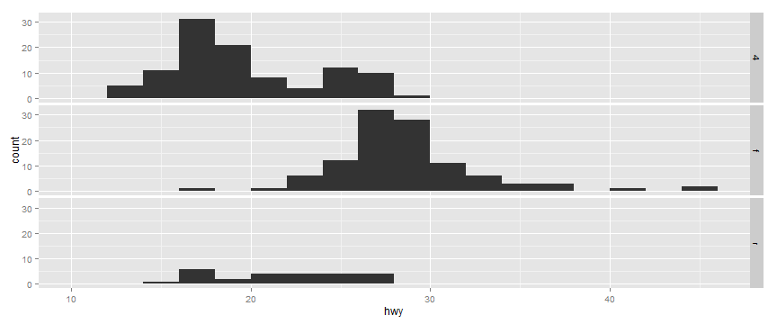

## Introduction: Data Analysis

"Solve this problem... Answer this question..."

1. Load the data
2. Clean it
3. Graph it
4. Change something
5. Send it to 'production'

---

## Problems

* Acquisition, cleaning, reporting all need separate tools
* Data and analysis live together in the same file
* Updating data is hard
* Describing what you did to someone else is nearly impossible

---

## Why R?

* It's free
* It has a very nice development environment: Rstudio - www.rstudio.com
* There is an active community of developers and support
* There is a wide variety of packages, which are easy to install

---

## Getting R

R - https://cran.r-project.org/

RStudio - https://www.rstudio.com/products/rstudio/download/

---

## Basics

* Use the <- operator to assign
* Don't use ; at the end of lines
* You don't have to declare a specific type


```r
x <- 1
x
```

```
## [1] 1
```

```r
y <- c(2, "red", 4)
y
```

```
## [1] "2"   "red" "4"
```

---

## Basics: Data Frames


```r
d <- c(1,2,3,4)
e <- c("red", "white", "red", NA)
f <- c(TRUE,TRUE,TRUE,FALSE)
mydata <- data.frame(d,e,f)
names(mydata) <- c("ID","Color","Passed") # variable names
print(mydata)
```

```
##   ID Color Passed
## 1  1   red   TRUE
## 2  2 white   TRUE
## 3  3   red   TRUE
## 4  4  <NA>  FALSE
```

http://www.statmethods.net/input/datatypes.html

---

## Basics: Data Frames


```r
print(mydata)
```

```
##   ID Color Passed
## 1  1   red   TRUE
## 2  2 white   TRUE
## 3  3   red   TRUE
## 4  4  <NA>  FALSE
```

```r
mydata[3,2]
```

```
## [1] red
## Levels: red white
```

---

## Basics: Factors


```r
# variable gender with 20 "male" entries and 30 "female" entries 
gender <- c(rep("male",20), rep("female", 30)) 
gender <- factor(gender) 
# stores gender as 20 1s and 30 2s and associates
# 1=female, 2=male internally (alphabetically)
summary(gender)
```

```
## female   male 
##     30     20
```

```r
str(gender)
```

```
##  Factor w/ 2 levels "female","male": 2 2 2 2 2 2 2 2 2 2 ...
```

http://www.statmethods.net/input/datatypes.html

---

## 1. Getting data from a database or website


```r
fileUrl <- "http://data.baltimorecity.gov/api/views/dz54-2aru/rows.csv?accessType=DOWNLOAD"
download.file(fileUrl,destfile="./data/cameras.csv")
list.files("./data")
```

```
## [1] "cameras.csv"     "restaurants.csv"
```

```r
dateDownloaded <- date()
dateDownloaded
```

```
## [1] "Wed Jul 22 08:40:53 2015"
```

https://github.com/rdpeng/courses/tree/master/03_GettingData

---

## 1. Getting data from a database or website


```r
cameraData <- read.table("./data/cameras.csv",sep=",",header=TRUE)
head(cameraData)
```

```
##                          address direction      street  crossStreet
## 1       S CATON AVE & BENSON AVE       N/B   Caton Ave   Benson Ave
## 2       S CATON AVE & BENSON AVE       S/B   Caton Ave   Benson Ave
## 3 WILKENS AVE & PINE HEIGHTS AVE       E/B Wilkens Ave Pine Heights
## 4        THE ALAMEDA & E 33RD ST       S/B The Alameda      33rd St
## 5        E 33RD ST & THE ALAMEDA       E/B      E 33rd  The Alameda
## 6        ERDMAN AVE & N MACON ST       E/B      Erdman     Macon St
##                 intersection                      Location.1
## 1     Caton Ave & Benson Ave (39.2693779962, -76.6688185297)
## 2     Caton Ave & Benson Ave (39.2693157898, -76.6689698176)
## 3 Wilkens Ave & Pine Heights  (39.2720252302, -76.676960806)
## 4     The Alameda  & 33rd St (39.3285013141, -76.5953545714)
## 5      E 33rd  & The Alameda (39.3283410623, -76.5953594625)
## 6         Erdman  & Macon St (39.3068045671, -76.5593167803)
```

---

## 1. Getting data from a database or website

Database connections  
  
[PostgreSQL - "RPostgreSQL"](https://cran.r-project.org/web/packages/RPostgreSQL/index.html)

[Oracle - "ROracle"](https://cran.r-project.org/web/packages/ROracle/index.html)

[MySQL - "RMySQL"](https://cran.r-project.org/web/packages/RMySQL/index.html)

---

## 1. Getting data from a database or website

PostgreSQL example
  

```r
drv <- dbDriver("PostgreSQL")                       # Load driver
con <- dbConnect(drv, dbname="tempdb")              # Connect
rs <- dbSendQuery(con,"select * from TableName")    # Run a query
fetch(rs,n=-1)                                      # Return all elements
dbDisconnect(con)                                   # Disconnect
dbUnloadDriver(drv)                                 # Unload driver
```

https://code.google.com/p/rpostgresql/

---

## 2. Cleaning Data


```r
fileUrl <- "http://data.baltimorecity.gov/api/views/k5ry-ef3g/rows.csv?accessType=DOWNLOAD"
download.file(fileUrl,destfile="./data/restaurants.csv")
restData <- read.csv("./data/restaurants.csv")
```

https://github.com/rdpeng/courses/blob/master/03_GettingData/03_02_summarizingData/index.Rmd

---

## 2. Cleaning Data

Summarizing data


```r
str(restData)
```

```
## 'data.frame':	1327 obs. of  6 variables:
##  $ name           : Factor w/ 1277 levels "#1 CHINESE KITCHEN",..: 9 3 992 1 2 4 5 6 7 8 ...
##  $ zipCode        : int  21206 21231 21224 21211 21223 21218 21205 21211 21205 21231 ...
##  $ neighborhood   : Factor w/ 173 levels "Abell","Arlington",..: 53 52 18 66 104 33 98 133 98 157 ...
##  $ councilDistrict: int  2 1 1 14 9 14 13 7 13 1 ...
##  $ policeDistrict : Factor w/ 9 levels "CENTRAL","EASTERN",..: 3 6 6 4 8 3 6 4 6 6 ...
##  $ Location.1     : Factor w/ 1210 levels "1 BIDDLE ST\nBaltimore, MD\n",..: 835 334 554 755 492 537 505 530 507 569 ...
```

https://github.com/rdpeng/courses/blob/master/03_GettingData/03_02_summarizingData/index.Rmd

---

## 2. Cleaning Data

Finding missing values


```r
sum(is.na(restData$councilDistrict))
```

```
## [1] 0
```

```r
all(restData$zipCode > 0)
```

```
## [1] FALSE
```

https://github.com/rdpeng/courses/blob/master/03_GettingData/03_02_summarizingData/index.Rmd

---

## 2. Cleaning Data

Finding specific values


```r
table(restData$zipCode %in% c("21212"))
```

```
## 
## FALSE  TRUE 
##  1299    28
```

```r
table(restData$zipCode %in% c("21212","21213"))
```

```
## 
## FALSE  TRUE 
##  1268    59
```

https://github.com/rdpeng/courses/blob/master/03_GettingData/03_02_summarizingData/index.Rmd

---

## 3. Making charts and graphs


```r
install.packages("ggplot2")
```


```r
library(ggplot2)
```

http://docs.ggplot2.org/current/

---

## 3. Making charts and graphs


```r
str(mpg)
```

```
## 'data.frame':	234 obs. of  11 variables:
##  $ manufacturer: Factor w/ 15 levels "audi","chevrolet",..: 1 1 1 1 1 1 1 1 1 1 ...
##  $ model       : Factor w/ 38 levels "4runner 4wd",..: 2 2 2 2 2 2 2 3 3 3 ...
##  $ displ       : num  1.8 1.8 2 2 2.8 2.8 3.1 1.8 1.8 2 ...
##  $ year        : int  1999 1999 2008 2008 1999 1999 2008 1999 1999 2008 ...
##  $ cyl         : int  4 4 4 4 6 6 6 4 4 4 ...
##  $ trans       : Factor w/ 10 levels "auto(av)","auto(l3)",..: 4 9 10 1 4 9 1 9 4 10 ...
##  $ drv         : Factor w/ 3 levels "4","f","r": 2 2 2 2 2 2 2 1 1 1 ...
##  $ cty         : int  18 21 20 21 16 18 18 18 16 20 ...
##  $ hwy         : int  29 29 31 30 26 26 27 26 25 28 ...
##  $ fl          : Factor w/ 5 levels "c","d","e","p",..: 4 4 4 4 4 4 4 4 4 4 ...
##  $ class       : Factor w/ 7 levels "2seater","compact",..: 2 2 2 2 2 2 2 2 2 2 ...
```

https://github.com/rdpeng/courses/blob/master/04_ExploratoryAnalysis/ggplot2/ggplot2_p1.Rmd

---

## 3. Making charts and graphs


```r
qplot(displ, hwy, data = mpg)
```

 

https://github.com/rdpeng/courses/blob/master/04_ExploratoryAnalysis/ggplot2/ggplot2_p1.Rmd

---

## 3. Making charts and graphs


```r
qplot(displ, hwy, data = mpg, color = drv)
```

 

https://github.com/rdpeng/courses/blob/master/04_ExploratoryAnalysis/ggplot2/ggplot2_p1.Rmd

---

## 3. Making charts and graphs


```r
qplot(displ, hwy, data = mpg, geom = c("point", "smooth"))
```

 

https://github.com/rdpeng/courses/blob/master/04_ExploratoryAnalysis/ggplot2/ggplot2_p1.Rmd

---

## 3. Making charts and graphs


```r
qplot(hwy, data = mpg, fill = drv)
```

 

https://github.com/rdpeng/courses/blob/master/04_ExploratoryAnalysis/ggplot2/ggplot2_p1.Rmd

---

## 3. Making charts and graphs


```r
qplot(displ, hwy, data = mpg, facets = . ~ drv)
```

 

https://github.com/rdpeng/courses/blob/master/04_ExploratoryAnalysis/ggplot2/ggplot2_p1.Rmd

---

## 3. Making charts and graphs


```r
qplot(hwy, data = mpg, facets = drv ~ ., binwidth = 2)
```

 

https://github.com/rdpeng/courses/blob/master/04_ExploratoryAnalysis/ggplot2/ggplot2_p1.Rmd

---

## 4. Interacting with data

`manipulate` function


```r
library(manipulate)
manipulate(plot(1:x), x = slider(1, 100))
```

[Documentation](https://support.rstudio.com/hc/en-us/articles/200551906-Interactive-Plotting-with-Manipulate)

---

## 5. Creating presentations and reports

* Presentations: You're looking at one
* Reports

http://rmarkdown.rstudio.com/

---

## Resources

[Swirl](http://swirlstats.com/)

[Coursera Data Science - Johns Hopkins](https://www.coursera.org/specialization/jhudatascience/1)

[Course Material](https://github.com/rdpeng/courses)

[Shiny Gallery](http://shiny.rstudio.com/gallery/)

---


## Junk

 _Genscape_

 _Genscape_

---

## Basics: If


```r
x <- 5

if (x > 3) {
    y <- 10
} else {
    y <- 0
}
print(y)
```

```
## [1] 10
```

---

## Basics: For


```r
for (i in 1:10) {
    print(i)
}
```

```
## [1] 1
## [1] 2
## [1] 3
## [1] 4
## [1] 5
## [1] 6
## [1] 7
## [1] 8
## [1] 9
## [1] 10
```

---
